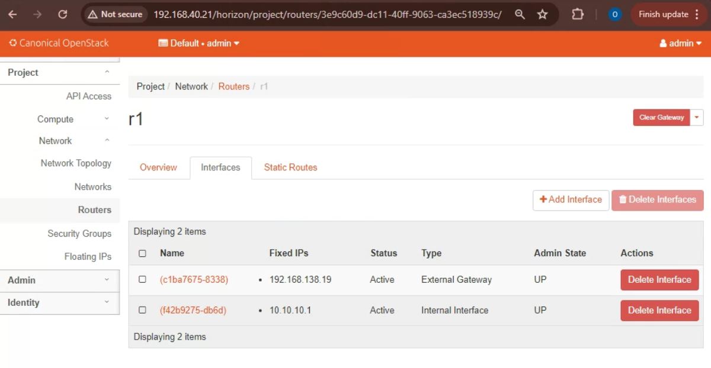

# Load Balancing in OpenStack Cloud

## Course Information

- **Course Name:** Algorithmic Problem Solving
- **Course Code:** 23ECSE309
- **Student Name:** Supreet Palankar
- **SRN:** 01fe21bcs068
- **Course Instructor:** Prakash Hegade
- **University:** KLE Technological University, Hubballi-31

## Portfolio Topic/Domain: Load Balancing in OpenStack Cloud

### A Move Towards Enhanced OpenStack Service Management

---

## Table of Contents

- [Introduction](#introduction)
- [Objectives/Need of Portfolio](#objectivesneed-of-portfolio)
- [Visuals](#visuals)
- [System Model](#system-model)
- [Algorithms and Data Structures: Business Use Cases and Applications](#algorithms-and-data-structures-business-use-cases-and-applications)
  - [Data Collection and Monitoring](#data-collection-and-monitoring)
  - [Ant Colony Optimization (ACO)](#ant-colony-optimization-aco-for-load-balancing)
  - [Weighted Round Robin Load Balancing](#weighted-round-robin-load-balancing)
  - [Round Robin Load Balancing](#round-robin-load-balancing)
  - [Least Connections Load Balancing](#least-connections-load-balancing)
  - [Least Load Load Balancing](#least-load-load-balancing)
  - [First-Come, First-Served (FCFS) Load Balancing](#first-come-first-served-fcfs-load-balancing)
  - [Priority Queue Load Balancing](#priority-queue-load-balancing)
  - [Shortest Job First (SJF) Load Balancing](#shortest-job-first-sjf-load-balancing)
  - [Depth-First Search (DFS) Load Balancing](#depth-first-search-dfs-load-balancing)
  - [Breadth-First Search (BFS) Load Balancing](#breadth-first-search-bfs-load-balancing)
  - [Binary Search Tree (BST) Load Balancing](#binary-search-tree-bst-load-balancing)
- [Challenges](#challenges)
- [To-Do](#to-do)
- [Conclusion](#conclusion)

---

## Introduction

Welcome to the Portfolio Project on **Load Balancing in OpenStack Cloud: Investigating Intelligent Data Structures**. This project is a deep dive into the advanced algorithms and data structures that power load balancing in OpenStack, enabling enhanced service management and efficiency.

OpenStack is a prominent open-source cloud computing platform that provides users with a convenient way to manage large-scale cloud environments. It leverages complex algorithms and data structures to ensure efficiency, reliability, and scalability in load balancing.

## Objectives/Need of Portfolio

The main objectives of this portfolio are:

- To understand the significance of advanced algorithms and data structures in efficient load balancing within OpenStack.
- To explore various business use cases and applications of these algorithms and data structures.
- To analyze the impact of these technologies on user experience and system performance.
- To provide insights into data analysis and the role of intelligent data structures in load balancing.

## Visuals

### Complete OpenStack Setup

*This image shows the complete OpenStack setup used for the project.*

### Networks Created

*This image displays the networks created within the OpenStack environment.*

### Router

*This image shows the router configuration within the OpenStack setup.*

### Instances Launched

*This image illustrates the instances launched in the OpenStack environment.*

### Topology

*This image illustrates the topology created in the OpenStack environment.*

## System Model

*The following diagram represents the process of load balancing in an OpenStack cloud environment using various algorithms.*

### Description

The system model depicted in the diagram represents the process of load balancing in an OpenStack cloud environment using various algorithms. Below is an explanation of each component in the diagram:

1. **User Request:**
   - This represents the incoming requests from users that need to be processed by the cloud instances.

2. **Load Balancing Algorithms:**
   - This component is responsible for deciding how to distribute the incoming requests among the available instances. It can use different algorithms such as Round Robin, Least Connections, Weighted Round Robin, Least Load, or Ant Colony Optimization (ACO) to make these decisions.

3. **Monitor Resource Usage:**
   - This module continuously monitors the resource usage (CPU, memory, etc.) of each instance. It provides real-time data that the load balancing algorithms use to make informed decisions about where to route incoming requests.

4. **Instances (Instance 1, Instance 2, ... , Instance n):**
   - These are the virtual machines or instances that actually process the user requests. The load balancer distributes the workload among these instances based on the selected algorithm and monitored resource usage.

## Algorithms and Data Structures: Business Use Cases and Applications

In this section, we propose to build and explore various algorithms and data structures that can be used to improve load balancing within OpenStack. By implementing these modules, we aim to manage services more efficiently and ensure optimal performance. The key focus areas of our project will include:

### Data Collection and Monitoring

Efficient load balancing starts with accurate data collection and monitoring. We will develop a module that gathers essential metrics such as CPU and memory usage from various instances. This data will be crucial for making informed load balancing decisions.

- **Click here:** [Data Collection](datacollection.md)

### Ant Colony Optimization (ACO) for Load Balancing

Ant Colony Optimization (ACO) is a probabilistic technique inspired by the foraging behavior of ants. It is used for solving computational problems which can be reduced to finding good paths through graphs. In the context of load balancing, ACO helps in dynamically distributing incoming requests to various instances by simulating the pheromone trail-following behavior of ants.

- **Click here:** [ACO Load Balancing](ant_colony.md)

### Weighted Round Robin Load Balancing

In the Weighted Round Robin Load Balancing module, we will enhance the Round Robin method by assigning weights to instances. More powerful instances will handle more requests, optimizing resource utilization and improving overall system performance.

- **Click here:** [Weighted Round Robin Load Balancing](weightedroundrobin.md)
  
### Round Robin Load Balancing

Round Robin Load Balancing is one of the simplest methods. We will implement this method to distribute incoming requests to instances in a circular order, ensuring a balanced distribution of load. This module will demonstrate how a straightforward algorithm can provide an effective load distribution.

- **Click here:** [Round Robin Load Balancing](roundrobin.md)

### Least Connections Load Balancing

The Least Connections Load Balancing module will assign incoming requests to the instance with the fewest active connections. This dynamic allocation helps in evenly distributing the load and preventing any single instance from becoming a bottleneck.

- **Click here:** [Least Connections Load Balancing](leastconnections.md)

### Least Load Load Balancing

The Least Load Load Balancing module will assign incoming requests to the instance with the least load, considering real-time metrics like CPU and memory usage. This approach ensures that the instance with the lowest load receives the next request, thereby improving response times and system efficiency.

- **Click here:** [Least Load Load Balancing](leastload.md)

## First-Come, First-Served (FCFS) Load Balancing

### Description:
The FCFS load balancing algorithm assigns incoming requests to instances in the order they arrive. This method ensures that each request is handled sequentially, maintaining the order of arrival.

- **Click here:** [FCFS Load Balancing](fcfs.md)

## Priority Queue Load Balancing

### Description:
Priority Queue load balancing assigns requests to instances based on their priority. Higher priority instances handle more critical tasks first, which can be determined by CPU or memory load or other metrics.

- **Click here:** [Priority Queue Load Balancing](priority_queue.md)

## Shortest Job First (SJF) Load Balancing

### Description:
The SJF algorithm assigns requests to the instance with the smallest current load, combining CPU and memory usage. This minimizes the average waiting time for requests and improves overall system performance.

- **Click here:** [SJF Load Balancing](sjf.md)

## Depth-First Search (DFS) Load Balancing

### Description:
DFS load balancing explores each instance's load in depth, evaluating multiple levels of load metrics. This thorough assessment helps in finding the optimal instance for request handling.

- **Click here:** [DFS Load Balancing](dfs.md)

## Breadth-First Search (BFS) Load Balancing

### Description:
BFS load balancing examines instances' load level by level, ensuring a fair and balanced consideration of all instances. It finds the least loaded instance in a balanced manner.

- **Click here:** [BFS Load Balancing](bfs.md)

## Binary Search Tree (BST) Load Balancing

### Description:
BST load balancing uses a binary search tree to efficiently find and assign requests to the instance with the least load. Instances are automatically kept sorted based on their load, making the search process efficient.

- **Click here:** [BST Load Balancing](bst.md)

## Why These Methods Are Better

### Ant Colony Optimization (ACO) for Load Balancing
**Advantages:**
- Adaptive Learning: Continuously updates the routing paths based on real-time data, leading to better performance over time.
- Scalability: Efficiently manages a large number of instances by distributing load based on pheromone trails.
- Resilience: Handles dynamic and unpredictable loads effectively by leveraging the collective learning of multiple agents (ants).

**Improvements over existing methods:**
- Enhanced Decision Making: Utilizes historical performance data through pheromone trails, leading to more informed and effective load distribution decisions.
- Optimized Resource Utilization: Ensures optimal use of available resources by dynamically adapting to changing conditions.
- Reduced Bottlenecks: Minimizes the risk of overloading individual instances by distributing requests based on real-time metrics and historical data.

### Weighted Round Robin Load Balancing
**Advantages:**
- Distributes traffic based on instance capabilities.
- More powerful instances handle more requests, optimizing resource utilization.

**Improvements over existing methods:**
- Provides a more nuanced distribution by considering the differing capacities of instances, leading to better overall performance.

### Round Robin Load Balancing
**Advantages:**
- Simple and easy to implement.
- Ensures equal distribution of traffic across all instances.

**Improvements over existing methods:**
- Provides a fair distribution of requests in a circular manner, avoiding the risk of overloading a single instance.

### Least Connections Load Balancing
**Advantages:**
- Dynamically allocates requests to instances with the fewest active connections.
- Helps in evenly distributing the load and preventing bottlenecks.

**Improvements over existing methods:**
- Unlike static allocation methods, it adapts to real-time traffic conditions, reducing the chances of overloading any single instance.

### Least Load Load Balancing
**Advantages:**
- Allocates traffic based on real-time load metrics like CPU and memory usage.
- Ensures that the instance with the lowest load receives the next request.

**Improvements over existing methods:**
- Offers a highly adaptive approach that ensures optimal use of resources by directing traffic to the least loaded instance, improving response times and system efficiency.

### First-Come, First-Served (FCFS) Load Balancing

**Advantages:**
- Simple and easy to implement.
- Ensures that requests are handled in the order they arrive, which can be fair in certain scenarios.

**Improvements over existing methods:**
- Provides a straightforward approach to request handling, reducing the risk of starvation.
- Useful in scenarios where request order is crucial and must be preserved.

### Priority Queue Load Balancing

**Advantages:**
- Assigns requests based on predefined priorities, ensuring that more critical tasks are handled first.
- Can be dynamically adjusted based on real-time metrics.

**Improvements over existing methods:**
- Enhances resource allocation efficiency by considering task priority.
- Allows for dynamic adjustment of instance priorities based on current load and performance metrics.

### Shortest Job First (SJF) Load Balancing

**Advantages:**
- Minimizes the average waiting time for requests by assigning them to the instance with the smallest current load.
- Efficient for scenarios where shorter tasks should be prioritized to improve overall system performance.

**Improvements over existing methods:**
- Reduces the overall response time by prioritizing instances with lower loads.
- Balances the system more effectively, especially in environments with varying task sizes.

### Depth-First Search (DFS) Load Balancing

**Advantages:**
- Explores each instance's load in depth, allowing for more thorough load assessment.
- Can help in finding the optimal instance by considering deeper levels of load information.

**Improvements over existing methods:**
- Provides a deeper analysis of instance loads, potentially leading to better load distribution.
- Useful in scenarios where instances have multiple levels of load metrics to consider.

### Breadth-First Search (BFS) Load Balancing

**Advantages:**
- Examines instances' load level by level, ensuring that all instances are considered fairly.
- Useful for finding the least loaded instance in a balanced manner.

**Improvements over existing methods:**
- Ensures a fair and balanced load distribution by considering all instances at each level.
- Effective in scenarios where load needs to be distributed evenly across all instances.

### Binary Search Tree (BST) Load Balancing

**Advantages:**
- Efficiently finds and assigns requests to the instance with the least load using binary search tree properties.
- Automatically keeps instances sorted based on their load.

**Improvements over existing methods:**
- Provides a fast and efficient way to find the optimal instance with minimal load.
- Automatically balances the load distribution as the tree structure maintains sorted order of instances by load.

### Time and Space Complexity of Load Balancing Algorithms

| Algorithm                    | Time Complexity                            | Space Complexity                         |
|------------------------------|--------------------------------------------|------------------------------------------|
| **Ant Colony Optimization**  | Depends on implementation complexity       | Depends on implementation complexity     |
| **Weighted Round Robin**     | O(1)                                       | O(n) (for storing instance weights)      |
| **Round Robin**              | O(1)                                       | O(n) (for storing instance states)       |
| **Least Connections**        | O(n) (to find instance with fewest connections) | O(n) (for storing instance states)      |
| **Least Load**               | O(n) (to find instance with least load)    | O(n) (for storing instance metrics)      |
| **First-Come, First-Served** | O(1)                                       | O(1)                                      |
| **Priority Queue**           | O(log n) (for insertion and extraction)    | O(n) (for storing instance priorities)   |
| **Shortest Job First**       | O(n) (to find instance with smallest load) | O(n) (for storing instance loads)        |
| **Depth-First Search**       | O(n) (to explore instance loads)           | O(n) (for storing instance loads)        |
| **Breadth-First Search**     | O(n) (to explore instance loads)           | O(n) (for storing instance loads)        |
| **Binary Search Tree**       | O(log n) (for insertion and searching)     | O(n) (for storing instance loads in BST) |

## Challenges

- Ensuring real-time data collection and monitoring.
- Implementing efficient algorithms to handle dynamic and unpredictable loads.
- Balancing the trade-off between simplicity and performance in algorithm design.

## To-Do

- Implement additional load balancing algorithms.
- Optimize data collection methods for minimal performance impact.

## Conclusion

This portfolio aims to provide a comprehensive understanding of how OpenStack leverages cutting-edge algorithms and data structures to maintain a competitive edge and deliver exceptional services to its users. By exploring and implementing various load balancing techniques, we can enhance the efficiency and reliability of OpenStack cloud environments.

---

Feel free to explore the different sections of this portfolio to gain insights into the intelligent data structures and algorithms used in load balancing within OpenStack.

